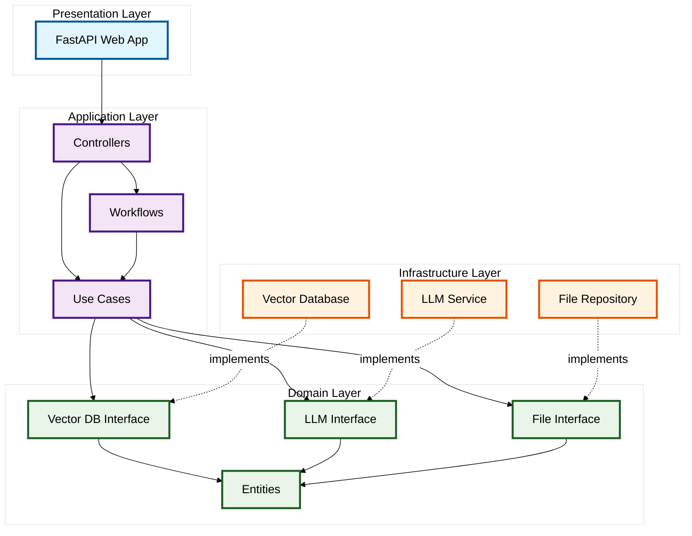
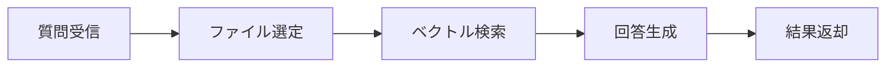

# DocExplain アプリケーション仕様書

## 概要

DocExplainは、ドキュメントに対してAI駆動の質問応答システムを提供するWebアプリケーションです。RAG（Retrieval-Augmented Generation）技術を使用して、アップロードされたドキュメントから関連情報を検索し、自然言語で回答を生成します。

## 目次

1. [システム概要](#システム概要)
2. [アーキテクチャ](#アーキテクチャ)
3. [技術スタック](#技術スタック)
4. [機能仕様](#機能仕様)
5. [API仕様](#api仕様)
6. [データベース設計](#データベース設計)
7. [セットアップ・運用](#セットアップ運用)
8. [ディレクトリ構成](#ディレクトリ構成)

## システム概要

### 主要機能

- **ドキュメント解析**: PDF、Markdown、テキストファイルの自動解析・インデックス化
- **セマンティック検索**: ベクトル検索による意味的関連性に基づくドキュメント検索
- **AI回答生成**: Google Gemini APIを使用した自然言語回答生成
- **スマートファイル選択**: LLMによる質問内容に応じた最適ファイル選択
- **Webインターフェース**: ユーザーフレンドリーな質問入力・回答表示画面

### 対象ユーザー

- ドキュメント管理者
- 研究者・エンジニア
- コンテンツ制作者
- 社内知識ベース利用者

## アーキテクチャ

### システム構成図

```
┌─────────────────┐    ┌─────────────────┐    ┌─────────────────┐
│   Web Frontend  │    │   FastAPI App   │    │   Vector DB     │
│   (HTML/CSS/JS) │◄──►│                 │◄──►│   (ChromaDB)    │
└─────────────────┘    └─────────────────┘    └─────────────────┘
                                │
                                ▼
                       ┌─────────────────┐
                       │   Google Gemini │
                       │      API        │
                       └─────────────────┘
```

### レイヤー構成

**プレゼンテーション層**
- Web UI（FastAPI + Jinja2テンプレート）
- Bootstrap 5を使用したレスポンシブデザイン

**アプリケーション層**
- コントローラー（リクエスト処理）
- ワークフロー（LangGraphによる処理フロー）
- ユースケース（ビジネスロジック）

**インフラストラクチャ層**
- ベクトルデータベース（ChromaDB）
- LLMサービス（Google Gemini）
- ドキュメントローダー（LangChain）

**ドメイン層**
- ドキュメントエンティティ
- インターフェース定義

### クリーンアーキテクチャ クラス図

#### 概要図（レイヤー構造）



### アーキテクチャの特徴

**依存性の方向**
- 外側の層は内側の層に依存する（依存性逆転の原則）
- インフラストラクチャ層はドメイン層のインターフェースを実装
- アプリケーション層はドメイン層のインターフェースに依存

**レイヤー間の役割**
- **プレゼンテーション層**: HTTPリクエスト/レスポンス処理
- **アプリケーション層**: ビジネスロジックの調整・ワークフロー制御
- **ドメイン層**: ビジネスルールとデータ構造の定義
- **インフラストラクチャ層**: 外部システムとの統合

## 技術スタック

### バックエンド

| 技術 | バージョン | 用途 |
|------|------------|------|
| Python | 3.11+ | メイン開発言語 |
| FastAPI | 0.104.0+ | Webフレームワーク |
| LangChain | 0.1.0+ | LLM統合・ドキュメント処理 |
| LangGraph | 0.0.20+ | ワークフロー管理 |
| ChromaDB | 0.4.18+ | ベクトルデータベース |
| Uvicorn | - | ASGIサーバー |

### フロントエンド

| 技術 | バージョン | 用途 |
|------|------------|------|
| Jinja2 | - | テンプレートエンジン |
| Bootstrap | 5.1.3 | UIフレームワーク |
| Font Awesome | - | アイコン |

### 外部サービス

| サービス | 用途 |
|----------|------|
| Google Gemini API | 自然言語生成 |
| Google Cloud Storage | ファイルストレージ（オプション） |

### 開発・運用

| 技術 | 用途 |
|------|------|
| Docker | コンテナ化 |
| Docker Compose | 開発環境構築 |
| python-dotenv | 環境変数管理 |

## 機能仕様

### 1. ドキュメントインデックス化

**処理フロー**
1. `data`ディレクトリ内のファイルを自動検出
2. ファイル形式に応じたローダーを選択（PDF/Markdown/Text）
3. テキスト分割（チャンクサイズ: 1000文字、オーバーラップ: 200文字）
4. ベクトル埋め込み生成・保存

**対応ファイル形式**
- PDF (.pdf)
- Markdown (.md)
- テキスト (.txt)

### 2. 質問応答ワークフロー

**LangGraphワークフロー**


**ファイル選定ロジック**
- 質問内容を分析
- 利用可能ファイル一覧を取得
- LLMに最適ファイル（最大3つ）を選択依頼
- 選択されたファイルでフィルタリング検索実行

### 3. セマンティック検索

**検索パラメータ**
- デフォルト結果数: 10件
- ファイルフィルタリング対応
- メタデータ付き結果返却

**結果情報**
- コンテンツプレビュー（100文字）
- ファイル名・パス
- チャンク番号
- チャンクID

## API仕様

### エンドポイント一覧

| メソッド | パス | 説明 |
|----------|------|------|
| GET | `/` | ホーム画面（質問入力フォーム） |
| POST | `/search` | 質問検索・回答生成 |
| GET | `/health` | ヘルスチェック |

### `/search` - 質問検索

**リクエスト**
```http
POST /search
Content-Type: application/x-www-form-urlencoded

question=要件について教えて
```

**レスポンス**
```html
<!-- HTMLテンプレートによる結果表示 -->
<!-- 質問、回答、ソース情報を含む -->
```

**処理フロー**
1. フォームデータから質問を取得
2. RAGワークフローを実行
3. 結果をHTMLテンプレートで表示

### `/health` - ヘルスチェック

**レスポンス**
```json
{
  "status": "healthy"
}
```

## データベース設計

### ChromaDB

**コレクション**: `documents`

**ドキュメント構造**
```python
{
    "content": "ドキュメントのテキスト内容",
    "metadata": {
        "filename": "ファイル名",
        "chunk_id": 0,
        "file_path": "ファイルパス"
    },
    "embedding": [0.1, 0.2, ...],  # ベクトル埋め込み
    "id": "一意のID"
}
```

**インデックス**
- ベクトル検索用のHNSWインデックス
- メタデータフィルタリング用インデックス

## セットアップ・運用

### 環境変数

**.env ファイル**
```env
GOOGLE_API_KEY="your-google-api-key"
GOOGLE_APPLICATION_CREDENTIALS="sa_key.json"
PYTHONDONTWRITEBYTECODE=1
```

### ローカル開発

**必要要件**
- Python 3.11+
- pip
- Google API キー

**起動手順**
```bash
# 依存関係インストール
pip install -r requirements.txt

# 環境変数設定
cp .env.example .env
# .envファイルを編集してAPIキーを設定

# データディレクトリにドキュメントを配置
cp your-documents.pdf data/

# Webサーバー起動
python -m uvicorn web.main:app --host 127.0.0.1 --port 8001 --reload
```

### Docker運用

**Docker Compose起動**
```bash
# ビルド・起動
docker-compose up --build

# バックグラウンド起動
docker-compose up -d
```

**設定ファイル**
- `docker-compose.yml`: コンテナ設定
- `Dockerfile`: イメージビルド設定

### データ管理

**ドキュメント追加**
1. `data`ディレクトリにファイルを配置
2. アプリケーションを再起動（自動インデックス化）

**データベース初期化**
- ChromaDBデータ: `chroma_db`ディレクトリを削除

## ディレクトリ構成

```
DocExplain/
├── app/                     # アプリケーションコア
│   ├── controller/          # コントローラー層
│   │   └── controller.py    # RAG・ファイルコントローラー
│   ├── domain/              # ドメイン層
│   │   └── document.py      # ドキュメントエンティティ
│   ├── infrastructure/      # インフラ層
│   │   ├── llm.py          # LLMサービス実装
│   │   ├── vector_db.py    # ベクトルDB実装
│   │   └── read_file.py    # ファイル読み込み実装
│   ├── interfaces/          # インターフェース定義
│   │   ├── llm_service.py
│   │   ├── vector_db_repository.py
│   │   └── read_file.py
│   ├── usecases/           # ユースケース層
│   │   ├── rag_usecase.py  # RAG処理ユースケース
│   │   └── read_file_usecase.py
│   ├── workflows/          # ワークフロー層
│   │   └── rag_workflow.py # LangGraphワークフロー
│   └── main.py            # エントリーポイント
├── web/                   # Webインターフェース
│   ├── main.py           # FastAPI アプリケーション
│   ├── static/           # 静的ファイル
│   │   └── style.css
│   └── templates/        # HTMLテンプレート
│       ├── base.html
│       ├── index.html    # ホーム画面
│       ├── result.html   # 検索結果画面
│       └── error.html    # エラー画面
├── data/                 # ドキュメントデータ
├── chroma_db/           # ChromaDBデータ
├── requirements.txt     # Python依存関係
├── docker-compose.yml   # Docker設定
├── Dockerfile          # Dockerイメージ設定
├── .env               # 環境変数
└── sa_key.json        # Google Cloud認証キー
```

## セキュリティ考慮事項

### 認証・認可
- 現在は認証機能なし（内部システム想定）
- 必要に応じてBasic認証やOAuth2の実装を推奨

### API セキュリティ
- Google API キーの適切な管理
- 環境変数による機密情報の保護
- CORS設定（必要に応じて）

### データ保護
- ローカルファイルシステムでのデータ保存
- ChromaDBのデータ永続化
- 機密文書の取り扱い注意

## パフォーマンス

### 最適化事項
- ベクトル検索の高速化（ChromaDB HNSW インデックス）
- チャンクサイズの最適化（1000文字）
- LLM APIの応答時間最適化

### スケーラビリティ
- 単一インスタンス構成
- 必要に応じてロードバランサー・複数インスタンス対応可能
- データベースのスケールアウト対応

## トラブルシューティング

### よくある問題

**1. Unicode エンコーディングエラー**
- 原因: 日本語文字の表示エラー
- 解決: コード内でのUnicodeエラーハンドリング実装済み

**2. Google API認証エラー**
- 原因: APIキーの未設定・無効
- 解決: `.env`ファイルでの正しいAPIキー設定

**3. ChromaDB コレクションエラー**
- 原因: データベースの不整合
- 解決: `chroma_db`ディレクトリ削除後の再起動

### ログ確認
```bash
# Docker環境でのログ確認
docker-compose logs -f

# ローカル環境でのログ
# コンソール出力を確認
```

## 今後の拡張予定

### 機能拡張
- ファイルアップロード機能
- 複数言語対応
- 会話履歴機能
- ユーザー認証システム

### 技術改善
- パフォーマンス向上
- UI/UXの改善
- テスト自動化
- CI/CD パイプライン

---

## 更新履歴

| 日付 | バージョン | 変更内容 |
|------|------------|----------|
| 2024-08-19 | 1.0.0 | 初版作成 |

## ライセンス

このドキュメントは DocExplain プロジェクトの一部です。