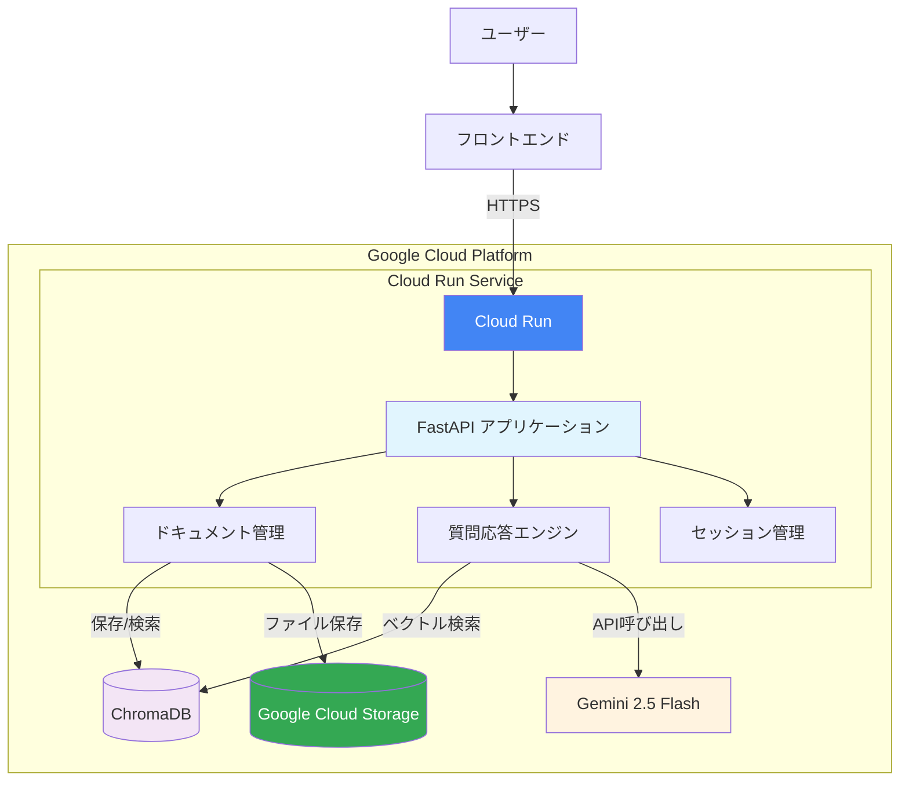
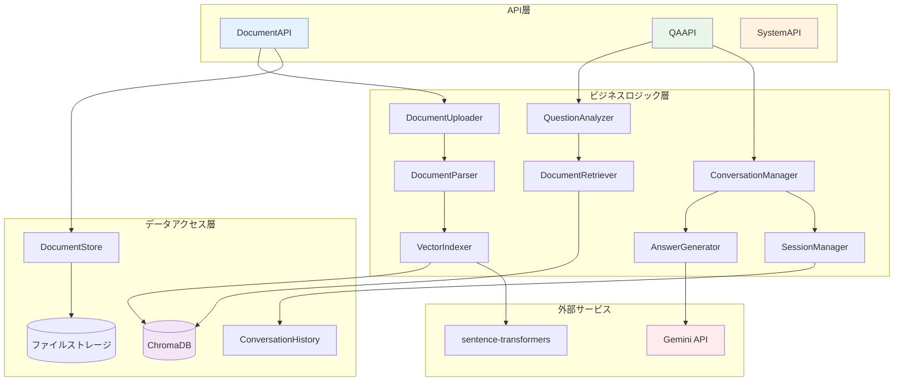
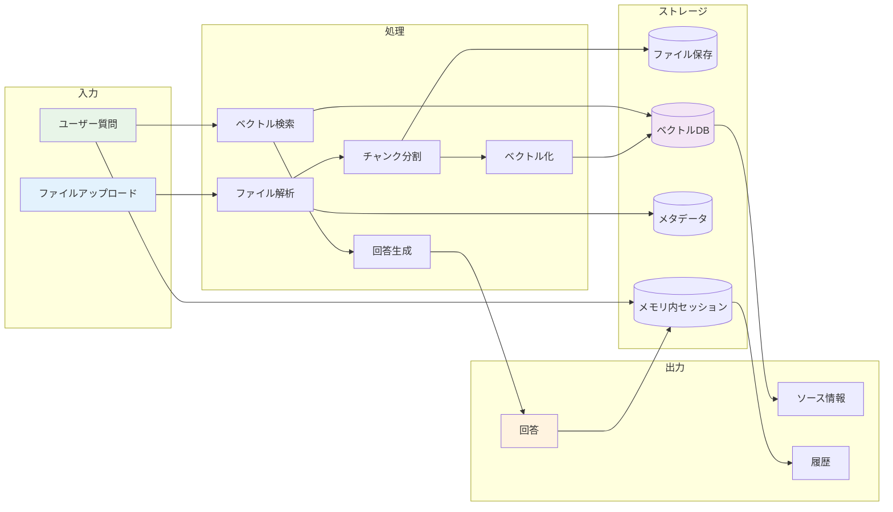
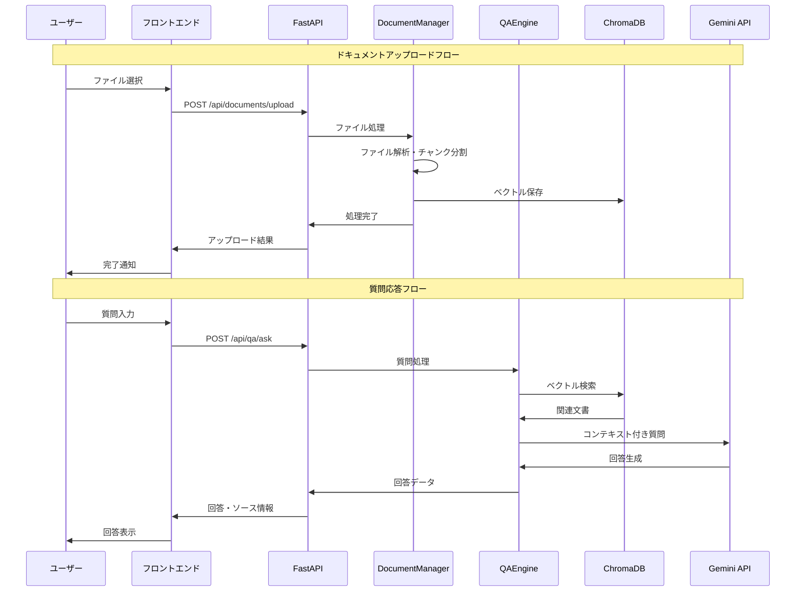
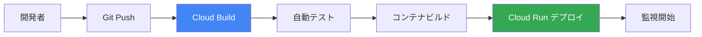

# AI QA システム基本設計書

## 1. システム概要

### 1.1 システム目的
システム設計書やドキュメントをAIが読み込み、ユーザーの質問に回答するWebシステムを構築する。

### 1.2 システム特徴
- 複数形式のドキュメント（PDF, DOCX, TXT, MD）を処理
- 自然言語による質問応答
- ベクトル検索による関連ドキュメント特定
- 会話履歴の管理

## 2. システム構成・アーキテクチャ

### 2.1 システム全体構成



### 2.2 技術スタック
- **バックエンド**: FastAPI（Python）
- **サーバー**: Google Cloud Run
- **AI/ML フレームワーク**: LangChain + LangGraph
- **LLM**: Gemini 2.5 flash
- **Storage**: Google Cloud Storage
- **ベクトルDB**: ChromaDB
- **埋め込みモデル**: sentence-transformers

### 2.3 アーキテクチャパターン
- レイヤードアーキテクチャ
  - API層（FastAPI）
  - ビジネスロジック層（LangChain/LangGraph）
  - データアクセス層（ChromaDB）

## 3. モジュール設計

### 3.0 モジュール関係図



### 3.1 ドキュメント管理モジュール
**責務**: ファイルのアップロード、変換、保存
- `DocumentUploader`: ファイルアップロード処理
- `DocumentParser`: 各形式ファイルの解析（PDF, DOCX, TXT, MD）
- `DocumentStore`: ドキュメントメタデータ管理
- `VectorIndexer`: ドキュメントのベクトル化・インデックス作成

### 3.2 質問応答モジュール
**責務**: 質問の解析、関連文書検索、回答生成
- `QuestionAnalyzer`: 質問文の解析・前処理
- `DocumentRetriever`: ベクトル検索による関連文書取得
- `AnswerGenerator`: LLMを使用した回答生成
- `ConversationManager`: 会話コンテキスト管理

### 3.3 会話履歴モジュール
**責務**: セッション管理、履歴管理（メモリ内）
- `SessionManager`: セッション生成・管理（メモリ内）
- `ConversationHistory`: 質問応答履歴の一時保存・取得

### 3.4 API層モジュール
**責務**: HTTPリクエスト処理、レスポンス生成
- `DocumentAPI`: ドキュメント関連エンドポイント
- `QAAPI`: 質問応答関連エンドポイント
- `SystemAPI`: システム関連エンドポイント

## 4. データ設計

### 4.0 データフロー図



### 4.1 ドキュメントメタデータ
```python
class DocumentMetadata:
    id: str
    filename: str
    file_type: str  # pdf, docx, txt, md
    upload_time: datetime
    file_size: int
    chunk_count: int
```

### 4.2 ドキュメントチャンク
```python
class DocumentChunk:
    id: str
    document_id: str
    content: str
    chunk_index: int
    embedding: List[float]
```

### 4.3 会話セッション（メモリ内）
```python
class ConversationSession:
    session_id: str
    created_at: datetime
    last_updated: datetime
    history: List[QAHistory]  # メモリ内で管理
```

### 4.4 質問応答履歴（メモリ内）
```python
class QAHistory:
    id: str
    question: str
    answer: str
    source_documents: List[str]
    timestamp: datetime
```

## 5. API設計

### 5.0 API構成図



### 5.1 ドキュメント管理API

#### ファイルアップロード
```
POST /api/documents/upload
Content-Type: multipart/form-data

Request:
- file: ファイル

Response:
{
  "document_id": "string",
  "filename": "string",
  "status": "uploaded"
}
```

#### ドキュメント一覧取得
```
GET /api/documents

Response:
{
  "documents": [
    {
      "id": "string",
      "filename": "string",
      "file_type": "string",
      "upload_time": "datetime",
      "file_size": "int"
    }
  ]
}
```

#### ドキュメント削除
```
DELETE /api/documents/{document_id}

Response:
{
  "message": "Document deleted successfully"
}
```

### 5.2 質問応答API

#### 質問投稿
```
POST /api/qa/ask

Request:
{
  "question": "string",
  "session_id": "string"  // optional
}

Response:
{
  "answer": "string",
  "source_documents": [
    {
      "document_id": "string",
      "chunk_text": "string",
      "relevance_score": "float"
    }
  ],
  "session_id": "string"
}
```

#### 会話履歴取得
```
GET /api/qa/conversations/{session_id}

Response:
{
  "session_id": "string",
  "history": [
    {
      "question": "string",
      "answer": "string",
      "timestamp": "datetime",
      "source_documents": ["string"]
    }
  ]
}
```

### 5.3 システムAPI

#### ヘルスチェック
```
GET /health

Response:
{
  "status": "healthy",
  "timestamp": "datetime"
}
```

## 6. セキュリティ設計

### 6.1 ファイルアップロード セキュリティ
- ファイルサイズ制限（最大100MB）
- 許可ファイル形式の検証
- ファイル内容のスキャン（マルウェア対策）
- アップロードファイルの隔離保存

### 6.2 API セキュリティ
- レート制限（1分間100リクエスト）
- CORS設定
- 入力値検証・サニタイゼーション
- エラーメッセージの情報漏洩防止

### 6.3 データ保護
- 機密情報の自動検出・マスキング
- ログの機密情報除外
- セッションデータの適切な有効期限設定

## 7. 非機能要件

### 7.1 性能要件
- 質問応答レスポンス時間: 5秒以内
- 同時接続ユーザー数: 100人
- ドキュメントアップロード処理時間: ファイルサイズに応じて適切な時間
- Cloud Run起動時間: コールドスタート3秒以内

### 7.2 可用性要件
- システム稼働率: 99.9%（Cloud Runの SLA）
- 自動スケーリング: 0〜100インスタンス
- リージョン: asia-northeast1（東京）

### 7.3 拡張性要件
- ドキュメント保存容量: Google Cloud Storage（実質無制限）
- 1日あたりの質問処理数: 10,000件
- Cloud Runの自動スケーリングによる負荷対応

### 7.4 運用要件
- ログ監視: Cloud Logging
- エラー通知: Cloud Monitoring + Alerting
- メトリクス監視: Cloud Monitoring
- セキュリティ: Cloud Security Command Center

## 8. 実装スケジュール

### Phase 1: 基盤構築（2週間）
- FastAPI基盤構築
- ドキュメントアップロード機能
- 基本的なファイル解析機能

### Phase 2: AI機能実装（3週間）
- ChromaDB設定
- ベクトル化・インデックス作成
- 基本的な質問応答機能

### Phase 3: 機能拡張（2週間）
- 会話履歴機能
- UI改善
- セキュリティ強化

### Phase 4: テスト・デプロイ（1週間）
- 統合テスト
- 性能テスト
- Cloud Runデプロイ設定
- 本番環境デプロイ

## 9. デプロイ・運用設計

### 9.1 Cloud Run デプロイ設定

#### コンテナ設定
```yaml
# cloudbuild.yaml
steps:
  - name: 'gcr.io/cloud-builders/docker'
    args: ['build', '-t', 'gcr.io/$PROJECT_ID/ai-qa-system', '.']
  - name: 'gcr.io/cloud-builders/docker'
    args: ['push', 'gcr.io/$PROJECT_ID/ai-qa-system']
  - name: 'gcr.io/cloud-builders/gcloud'
    args:
      - 'run'
      - 'deploy'
      - 'ai-qa-system'
      - '--image'
      - 'gcr.io/$PROJECT_ID/ai-qa-system'
      - '--region'
      - 'asia-northeast1'
      - '--platform'
      - 'managed'
```

#### サービス設定
- **CPU**: 2 vCPU
- **メモリ**: 4GB
- **最大インスタンス数**: 100
- **最小インスタンス数**: 0（コスト最適化）
- **タイムアウト**: 300秒
- **同時実行数**: 10リクエスト/インスタンス

### 9.2 環境変数設定
```bash
GOOGLE_CLOUD_PROJECT=your-project-id
GEMINI_API_KEY=your-gemini-api-key
CHROMADB_HOST=localhost
CHROMADB_PORT=8000
GCS_BUCKET_NAME=ai-qa-documents
LOG_LEVEL=INFO
```

### 9.3 IAM権限設定
- **Cloud Run Service Account**:
  - `roles/storage.objectAdmin` (GCS アクセス)
  - `roles/aiplatform.user` (Gemini API アクセス)
  - `roles/logging.logWriter` (ログ出力)
  - `roles/monitoring.metricWriter` (メトリクス送信)

### 9.4 監視・アラート設定
- **CPU使用率**: 80%超過でアラート
- **メモリ使用率**: 85%超過でアラート
- **レスポンス時間**: 5秒超過でアラート
- **エラー率**: 5%超過でアラート
- **リクエスト数**: 異常な増加でアラート

### 9.5 CI/CD パイプライン
