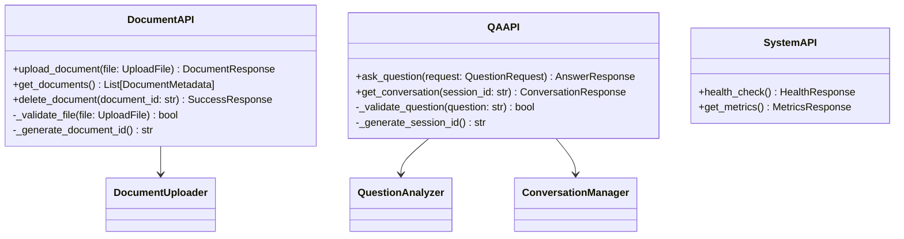
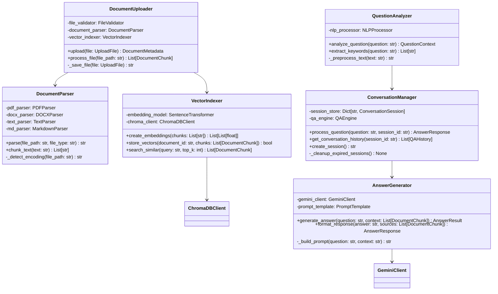
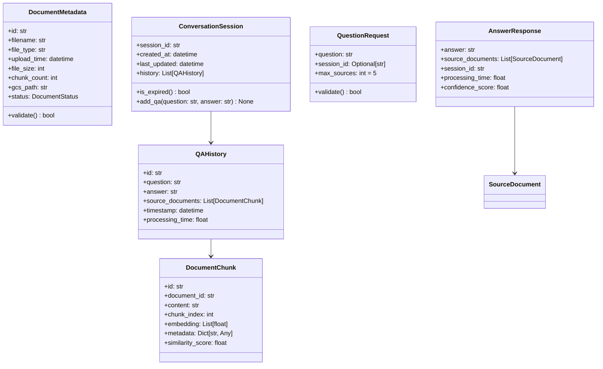
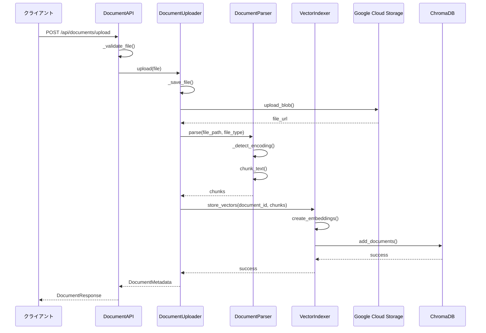
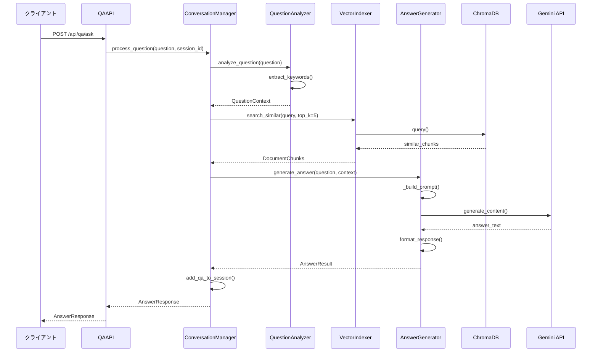
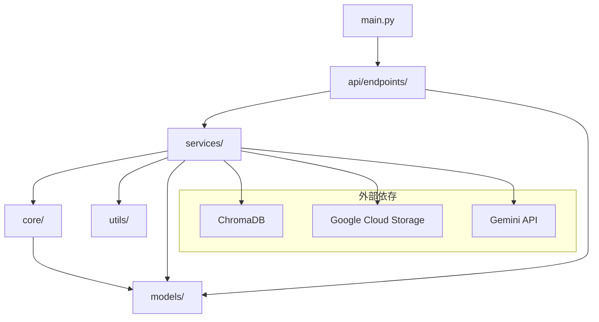

# AI QA システム詳細設計書

## 1. 概要

本文書は基本設計書に基づく詳細設計仕様を定義する。

## 2. クラス設計

### 2.1 API層クラス設計



### 2.2 ビジネスロジック層クラス設計



### 2.3 データモデルクラス



## 3. シーケンス図

### 3.1 ドキュメントアップロード処理



### 3.2 質問応答処理



## 4. データベース詳細設計

### 4.1 ChromaDB コレクション設計

#### ドキュメントコレクション
```python
COLLECTION_NAME = "ai_qa_documents"

# メタデータスキーマ
metadata_schema = {
    "document_id": str,      # ドキュメント識別子
    "filename": str,         # 元のファイル名
    "file_type": str,        # ファイル形式（pdf, docx, txt, md）
    "chunk_index": int,      # チャンク番号
    "upload_time": str,      # アップロード時刻（ISO形式）
    "file_size": int,        # ファイルサイズ（バイト）
    "chunk_length": int,     # チャンク文字数
    "language": str,         # 言語（ja, en）
}

# インデックス設定
index_config = {
    "hnsw_space": "cosine",     # コサイン類似度
    "hnsw_construction_ef": 200,
    "hnsw_m": 16,
    "batch_size": 1000,
}
```

### 4.2 Google Cloud Storage 設計

#### バケット構成
```
ai-qa-documents/
├── documents/              # アップロードファイル
│   ├── {document_id}/
│   │   ├── original.{ext}  # 元ファイル
│   │   └── metadata.json   # メタデータ
├── temp/                   # 一時ファイル
└── logs/                   # 処理ログ
```

#### ファイル命名規則
```python
# ドキュメントID生成
document_id = f"{timestamp}_{uuid4().hex[:8]}"

# GCSパス
gcs_path = f"documents/{document_id}/original.{file_extension}"

# メタデータファイル
metadata_path = f"documents/{document_id}/metadata.json"
```

## 5. API詳細仕様

### 5.1 ドキュメント管理API

#### ファイルアップロード
```python
@router.post("/upload", response_model=DocumentResponse)
async def upload_document(
    file: UploadFile = File(...),
    background_tasks: BackgroundTasks = BackgroundTasks()
) -> DocumentResponse:
    """
    ファイルアップロード
    
    Args:
        file: アップロードファイル
        
    Returns:
        DocumentResponse: アップロード結果
        
    Raises:
        HTTPException(400): ファイル形式不正
        HTTPException(413): ファイルサイズ超過
        HTTPException(500): 処理エラー
    """
    
# リクエスト制限
MAX_FILE_SIZE = 100 * 1024 * 1024  # 100MB
ALLOWED_EXTENSIONS = {".pdf", ".docx", ".txt", ".md"}

# レスポンスモデル
class DocumentResponse(BaseModel):
    document_id: str
    filename: str
    file_type: str
    status: str
    upload_time: datetime
    processing_status: str  # "pending", "processing", "completed", "failed"
```

#### ドキュメント一覧取得
```python
@router.get("", response_model=DocumentListResponse)
async def get_documents(
    skip: int = Query(0, ge=0),
    limit: int = Query(50, ge=1, le=100),
    file_type: Optional[str] = Query(None)
) -> DocumentListResponse:
    """
    ドキュメント一覧取得
    
    Args:
        skip: スキップ件数
        limit: 取得件数
        file_type: ファイル形式フィルタ
        
    Returns:
        DocumentListResponse: ドキュメント一覧
    """

class DocumentListResponse(BaseModel):
    documents: List[DocumentMetadata]
    total_count: int
    skip: int
    limit: int
```

### 5.2 質問応答API

#### 質問投稿
```python
@router.post("/ask", response_model=AnswerResponse)
async def ask_question(
    request: QuestionRequest
) -> AnswerResponse:
    """
    質問投稿
    
    Args:
        request: 質問リクエスト
        
    Returns:
        AnswerResponse: 回答
        
    Raises:
        HTTPException(400): 質問内容不正
        HTTPException(404): セッション不存在
        HTTPException(500): 処理エラー
    """

# リクエストバリデーション
class QuestionRequest(BaseModel):
    question: str = Field(..., min_length=1, max_length=1000)
    session_id: Optional[str] = Field(None, regex=r"^[a-zA-Z0-9_-]+$")
    max_sources: int = Field(5, ge=1, le=10)
    
    @validator('question')
    def validate_question(cls, v):
        if not v.strip():
            raise ValueError('質問文は必須です')
        return v.strip()

# レスポンスモデル
class AnswerResponse(BaseModel):
    answer: str
    source_documents: List[SourceDocument]
    session_id: str
    processing_time: float
    confidence_score: float = Field(..., ge=0.0, le=1.0)
    
class SourceDocument(BaseModel):
    document_id: str
    filename: str
    chunk_text: str = Field(..., max_length=500)  # 表示用に制限
    relevance_score: float = Field(..., ge=0.0, le=1.0)
```

## 6. エラーハンドリング設計

### 6.1 エラーコード体系

```python
class ErrorCode(Enum):
    # ファイル関連エラー (1000番台)
    INVALID_FILE_FORMAT = 1001
    FILE_SIZE_EXCEEDED = 1002
    FILE_UPLOAD_FAILED = 1003
    FILE_PARSING_FAILED = 1004
    
    # 質問応答関連エラー (2000番台)
    INVALID_QUESTION = 2001
    SESSION_NOT_FOUND = 2002
    NO_DOCUMENTS_FOUND = 2003
    LLM_API_ERROR = 2004
    
    # システムエラー (9000番台)
    DATABASE_ERROR = 9001
    EXTERNAL_API_ERROR = 9002
    INTERNAL_SERVER_ERROR = 9999

class APIError(Exception):
    def __init__(self, code: ErrorCode, message: str, details: dict = None):
        self.code = code
        self.message = message
        self.details = details or {}
        super().__init__(self.message)

# エラーレスポンスモデル
class ErrorResponse(BaseModel):
    error_code: int
    error_message: str
    details: Dict[str, Any] = {}
    timestamp: datetime
    request_id: str
```

### 6.2 例外ハンドラー

```python
@app.exception_handler(APIError)
async def api_error_handler(request: Request, exc: APIError):
    return JSONResponse(
        status_code=_get_http_status(exc.code),
        content=ErrorResponse(
            error_code=exc.code.value,
            error_message=exc.message,
            details=exc.details,
            timestamp=datetime.utcnow(),
            request_id=str(uuid4())
        ).dict()
    )

@app.exception_handler(ValidationError)
async def validation_error_handler(request: Request, exc: ValidationError):
    return JSONResponse(
        status_code=422,
        content=ErrorResponse(
            error_code=4001,
            error_message="入力値検証エラー",
            details={"validation_errors": exc.errors()},
            timestamp=datetime.utcnow(),
            request_id=str(uuid4())
        ).dict()
    )
```

## 7. 設定・環境変数

### 7.1 環境変数設定

```python
class Settings(BaseSettings):
    # アプリケーション設定
    app_name: str = "AI QA System"
    debug: bool = False
    log_level: str = "INFO"
    
    # Google Cloud設定
    google_cloud_project: str
    gcs_bucket_name: str
    
    # AI/ML設定
    gemini_api_key: str
    gemini_model: str = "gemini-1.5-pro"
    embedding_model: str = "sentence-transformers/all-MiniLM-L6-v2"
    
    # ChromaDB設定
    chromadb_host: str = "localhost"
    chromadb_port: int = 8000
    chromadb_collection: str = "ai_qa_documents"
    
    # ファイル処理設定
    max_file_size: int = 100 * 1024 * 1024  # 100MB
    chunk_size: int = 1000
    chunk_overlap: int = 200
    
    # セッション設定
    session_timeout: int = 3600  # 1時間
    max_sessions: int = 1000
    
    # API設定
    api_rate_limit: str = "100/minute"
    cors_origins: List[str] = ["*"]
    
    class Config:
        env_file = ".env"
        case_sensitive = False

settings = Settings()
```

### 7.2 ログ設定

```python
LOGGING_CONFIG = {
    "version": 1,
    "disable_existing_loggers": False,
    "formatters": {
        "default": {
            "format": "{time:YYYY-MM-DD HH:mm:ss} | {level} | {name}:{function}:{line} | {message}",
            "style": "{",
        },
        "json": {
            "format": '{"time": "{time}", "level": "{level}", "logger": "{name}", "function": "{function}", "line": {line}, "message": "{message}"}',
            "style": "{",
        },
    },
    "handlers": {
        "console": {
            "class": "logging.StreamHandler",
            "formatter": "default",
            "level": "INFO",
        },
        "file": {
            "class": "logging.handlers.RotatingFileHandler",
            "filename": "logs/app.log",
            "maxBytes": 10485760,  # 10MB
            "backupCount": 5,
            "formatter": "json",
            "level": "DEBUG",
        },
    },
    "loggers": {
        "app": {
            "handlers": ["console", "file"],
            "level": "DEBUG",
            "propagate": False,
        },
        "uvicorn": {
            "handlers": ["console"],
            "level": "INFO",
            "propagate": False,
        },
    },
}
```

## 8. テスト設計

### 8.1 ユニットテスト

```python
# テストケース例
class TestDocumentUploader:
    def test_upload_valid_pdf(self):
        """有効なPDFファイルのアップロードテスト"""
        pass
    
    def test_upload_invalid_format(self):
        """無効なファイル形式のテスト"""
        pass
    
    def test_file_size_exceeded(self):
        """ファイルサイズ超過のテスト"""
        pass

class TestQuestionAnalyzer:
    def test_analyze_simple_question(self):
        """シンプルな質問の解析テスト"""
        pass
    
    def test_extract_keywords(self):
        """キーワード抽出のテスト"""
        pass

class TestAnswerGenerator:
    def test_generate_answer_with_context(self):
        """コンテキスト付き回答生成テスト"""
        pass
    
    def test_handle_llm_api_error(self):
        """LLM APIエラーハンドリングテスト"""
        pass
```

### 8.2 統合テスト

```python
class TestDocumentUploadFlow:
    def test_end_to_end_upload(self):
        """エンドツーエンドアップロードテスト"""
        # 1. ファイルアップロード
        # 2. ファイル解析
        # 3. ベクトル化
        # 4. ChromaDB保存
        # 5. GCS保存
        pass

class TestQAFlow:
    def test_end_to_end_qa(self):
        """エンドツーエンド質問応答テスト"""
        # 1. 質問投稿
        # 2. ベクトル検索
        # 3. LLM回答生成
        # 4. レスポンス返却
        pass
```

### 8.3 性能テスト

```python
class TestPerformance:
    def test_concurrent_uploads(self):
        """同時アップロードテスト"""
        pass
    
    def test_response_time(self):
        """レスポンス時間テスト（5秒以内）"""
        pass
    
    def test_memory_usage(self):
        """メモリ使用量テスト"""
        pass
```

## 9. 実装ガイドライン

### 9.1 コーディング規約
- PEP 8準拠
- Type hints必須
- Docstring必須（Google style）
- 関数・クラス名は英語

### 9.2 依存関係管理
```python
# requirements.txt
fastapi==0.104.1
uvicorn==0.24.0
pydantic==2.5.0
langchain==0.0.350
chromadb==0.4.15
sentence-transformers==2.2.2
google-cloud-storage==2.10.0
google-generativeai==0.3.2
python-multipart==0.0.6
```

### 9.3 ディレクトリ構成

```
app/                           # アプリケーションルート
├── api/                       # API層（エンドポイント定義）
│   ├── endpoints/            # 各機能のエンドポイント
│   │   ├── documents.py      # ドキュメント管理API（アップロード、一覧、削除）
│   │   ├── qa.py            # 質問応答API（質問投稿、履歴取得）
│   │   └── system.py        # システムAPI（ヘルスチェック、メトリクス）
│   └── dependencies.py      # 依存関係注入（認証、DB接続など）
├── core/                     # コア機能・設定
│   ├── config.py            # 環境変数、設定クラス
│   ├── logging.py           # ログ設定
│   └── exceptions.py        # カスタム例外クラス
├── models/                   # データモデル（Pydantic）
│   ├── document.py          # DocumentMetadata, DocumentChunk
│   ├── qa.py               # QuestionRequest, AnswerResponse
│   └── session.py          # ConversationSession, QAHistory
├── services/                 # ビジネスロジック層
│   ├── document_service.py  # DocumentUploader, DocumentParser
│   ├── qa_service.py        # QuestionAnalyzer, AnswerGenerator
│   └── storage_service.py   # ChromaDB, GCS操作
├── utils/                    # ユーティリティ関数
│   ├── file_utils.py        # ファイル処理、バリデーション
│   └── text_utils.py        # テキスト前処理、チャンク分割
├── tests/                    # テストコード
│   ├── unit/                # ユニットテスト
│   │   ├── test_document_service.py
│   │   ├── test_qa_service.py
│   │   └── test_storage_service.py
│   ├── integration/         # 統合テスト
│   │   ├── test_document_flow.py
│   │   └── test_qa_flow.py
│   └── conftest.py         # テスト設定
├── static/                   # 静的ファイル
├── requirements.txt          # 依存関係
├── Dockerfile               # コンテナ設定
├── cloudbuild.yaml          # Cloud Build設定
├── .env.example             # 環境変数テンプレート
├── .gitignore              # Git除外設定
└── main.py                  # FastAPIアプリケーション起動
```

#### 各ディレクトリの詳細

**api/endpoints/**
```python
# documents.py - ドキュメント管理エンドポイント
@router.post("/upload")           # ファイルアップロード
@router.get("")                   # ドキュメント一覧取得
@router.delete("/{document_id}")  # ドキュメント削除

# qa.py - 質問応答エンドポイント
@router.post("/ask")                        # 質問投稿
@router.get("/conversations/{session_id}")  # 会話履歴取得

# system.py - システムエンドポイント
@router.get("/health")    # ヘルスチェック
@router.get("/metrics")   # メトリクス取得
```

**services/** - ビジネスロジック実装
```python
# document_service.py
class DocumentUploader:
    async def upload_document(file: UploadFile) -> DocumentMetadata
    async def process_file(file_path: str) -> List[DocumentChunk]

class DocumentParser:
    def parse_pdf(file_path: str) -> str
    def parse_docx(file_path: str) -> str
    def chunk_text(text: str) -> List[str]

# qa_service.py
class QuestionAnalyzer:
    def analyze_question(question: str) -> QuestionContext
    def extract_keywords(question: str) -> List[str]

class AnswerGenerator:
    async def generate_answer(question: str, context: List[DocumentChunk]) -> AnswerResult
    
# storage_service.py
class ChromaDBService:
    async def store_vectors(document_id: str, chunks: List[DocumentChunk]) -> bool
    async def search_similar(query: str, top_k: int) -> List[DocumentChunk]

class GCSService:
    async def upload_file(file: UploadFile, path: str) -> str
    async def delete_file(path: str) -> bool
```

**models/** - データモデル定義
```python
# document.py
class DocumentMetadata(BaseModel):
    id: str
    filename: str
    file_type: str
    upload_time: datetime
    file_size: int
    chunk_count: int
    gcs_path: str
    status: DocumentStatus

class DocumentChunk(BaseModel):
    id: str
    document_id: str
    content: str
    chunk_index: int
    embedding: List[float]
    metadata: Dict[str, Any]

# qa.py
class QuestionRequest(BaseModel):
    question: str = Field(..., min_length=1, max_length=1000)
    session_id: Optional[str] = None
    max_sources: int = Field(5, ge=1, le=10)

class AnswerResponse(BaseModel):
    answer: str
    source_documents: List[SourceDocument]
    session_id: str
    processing_time: float
    confidence_score: float

# session.py
class ConversationSession(BaseModel):
    session_id: str
    created_at: datetime
    last_updated: datetime
    history: List[QAHistory]

class QAHistory(BaseModel):
    id: str
    question: str
    answer: str
    source_documents: List[DocumentChunk]
    timestamp: datetime
```

**core/** - アプリケーション基盤
```python
# config.py
class Settings(BaseSettings):
    app_name: str = "AI QA System"
    debug: bool = False
    google_cloud_project: str
    gemini_api_key: str
    chromadb_host: str = "localhost"
    max_file_size: int = 100 * 1024 * 1024

# exceptions.py
class APIError(Exception):
    def __init__(self, code: ErrorCode, message: str, details: dict = None)

class ErrorCode(Enum):
    INVALID_FILE_FORMAT = 1001
    FILE_SIZE_EXCEEDED = 1002
    LLM_API_ERROR = 2004

# logging.py
LOGGING_CONFIG = {
    "version": 1,
    "formatters": {...},
    "handlers": {...},
    "loggers": {...}
}
```

**utils/** - 共通ユーティリティ
```python
# file_utils.py
def validate_file_type(filename: str) -> bool
def get_file_size(file: UploadFile) -> int
def generate_document_id() -> str
def detect_encoding(file_path: str) -> str

# text_utils.py
def preprocess_text(text: str) -> str
def split_text_into_chunks(text: str, chunk_size: int, overlap: int) -> List[str]
def extract_keywords(text: str) -> List[str]
def clean_text(text: str) -> str
```

#### ファイルの依存関係



#### 設定ファイル詳細

**requirements.txt**
```
fastapi==0.104.1
uvicorn[standard]==0.24.0
pydantic==2.5.0
langchain==0.0.350
chromadb==0.4.15
sentence-transformers==2.2.2
google-cloud-storage==2.10.0
google-generativeai==0.3.2
python-multipart==0.0.6
pytest==7.4.3
pytest-asyncio==0.21.1
```

**Dockerfile**
```dockerfile
FROM python:3.11-slim

WORKDIR /app
COPY requirements.txt .
RUN pip install --no-cache-dir -r requirements.txt

COPY app/ ./app/
COPY main.py .

EXPOSE 8080
CMD ["uvicorn", "main:app", "--host", "0.0.0.0", "--port", "8080"]
```

**cloudbuild.yaml**
```yaml
steps:
  - name: 'gcr.io/cloud-builders/docker'
    args: ['build', '-t', 'gcr.io/$PROJECT_ID/ai-qa-system', '.']
  - name: 'gcr.io/cloud-builders/docker'
    args: ['push', 'gcr.io/$PROJECT_ID/ai-qa-system']
  - name: 'gcr.io/cloud-builders/gcloud'
    args:
      - 'run'
      - 'deploy'
      - 'ai-qa-system'
      - '--image'
      - 'gcr.io/$PROJECT_ID/ai-qa-system'
      - '--region'
      - 'asia-northeast1'
      - '--platform'
      - 'managed'
```