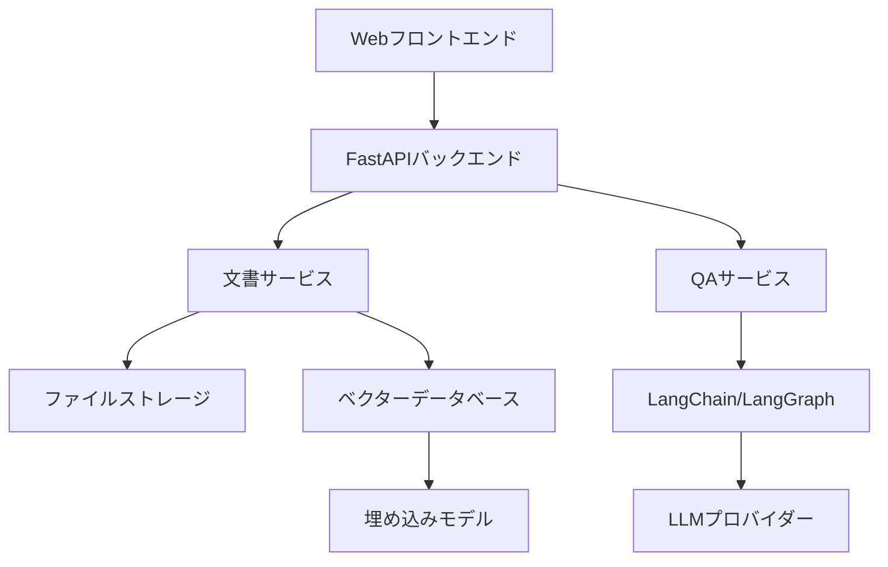

# 設計書

## 概要

AI QAシステムは、ユーザーがシステム設計書をアップロードし、AI駆動の自然言語処理を使用してその内容について質問できるWebベースのアプリケーションです。システムはWebフレームワークにFastAPI、文書処理と埋め込みにLangChain、複雑なAIワークフローの調整にLangGraphを活用します。

## アーキテクチャ

システムは関心の分離を明確にしたレイヤードアーキテクチャパターンに従います：



### コアコンポーネント:
- **Webフロントエンド**: ファイルアップロードとチャット用のシンプルなHTML/JavaScriptインターフェース
- **FastAPIバックエンド**: HTTPリクエストとレスポンスを処理するRESTful API
- **文書サービス**: ファイルアップロード、解析、ベクトル化を処理
- **QAサービス**: ユーザーの質問を処理し、回答を生成
- **ベクターデータベース**: セマンティック検索用の文書埋め込みを保存
- **LangGraphワークフロー**: 質問応答パイプラインを調整

## コンポーネントとインターフェース

### 1. FastAPIアプリケーション構造

```python
# メインアプリケーション構造
app/
├── main.py                 # FastAPIアプリ初期化
├── routers/
│   ├── documents.py        # 文書アップロード/管理エンドポイント
│   └── qa.py              # 質問応答エンドポイント
├── services/
│   ├── document_service.py # 文書処理ロジック
│   └── qa_service.py      # QA処理ロジック
├── models/
│   ├── document.py        # 文書データモデル
│   └── qa.py             # QAリクエスト/レスポンスモデル
└── core/
    ├── config.py          # 設定管理
    └── dependencies.py    # 依存性注入
```

### 2. 文書処理パイプライン

**文書サービスインターフェース:**
- `upload_document(file: UploadFile) -> DocumentResponse`
- `process_document(document_id: str) -> ProcessingStatus`
- `get_documents() -> List[DocumentSummary]`
- `delete_document(document_id: str) -> bool`

**処理ステップ:**
1. ファイル検証と保存
2. LangChain文書ローダーを使用したテキスト抽出
3. コンテキスト保持のためのオーバーラップ付きテキストチャンク化
4. Sentence Transformersを使用した埋め込み生成
5. ChromaDBまたは類似のベクターストレージ

### 3. 質問応答パイプライン

**QAサービスインターフェース:**
- `ask_question(question: str, document_ids: List[str]) -> QAResponse`
- `get_conversation_history(session_id: str) -> List[QAExchange]`

**LangGraphワークフロー:**


### 4. APIエンドポイント

**文書管理:**
- `POST /api/documents/upload` - 新しい文書をアップロード
- `GET /api/documents` - アップロードされた文書一覧
- `DELETE /api/documents/{document_id}` - 文書削除
- `GET /api/documents/{document_id}/status` - 処理状況確認

**質問応答:**
- `POST /api/qa/ask` - 質問送信
- `GET /api/qa/conversations/{session_id}` - 会話履歴取得
- `POST /api/qa/conversations` - 新しい会話開始

## データモデル

### 文書モデル
```python
class Document(BaseModel):
    id: str
    filename: str
    file_type: str
    upload_timestamp: datetime
    processing_status: ProcessingStatus
    content_hash: str
    chunk_count: int
    
class DocumentChunk(BaseModel):
    id: str
    document_id: str
    content: str
    embedding: List[float]
    metadata: Dict[str, Any]
```

### QAモデル
```python
class QARequest(BaseModel):
    question: str
    document_ids: Optional[List[str]] = None
    session_id: Optional[str] = None
    
class QAResponse(BaseModel):
    answer: str
    confidence_score: float
    source_chunks: List[SourceChunk]
    session_id: str
    
class SourceChunk(BaseModel):
    document_id: str
    document_name: str
    content: str
    relevance_score: float
```

## エラーハンドリング

### エラーカテゴリ:
1. **ファイルアップロードエラー**: 無効な形式、サイズ制限、破損
2. **処理エラー**: テキスト抽出失敗、埋め込み生成問題
3. **クエリエラー**: 不正な質問、関連文書なし
4. **システムエラー**: データベース接続、LLM API失敗

### エラーレスポンス形式:
```python
class ErrorResponse(BaseModel):
    error_code: str
    message: str
    details: Optional[Dict[str, Any]] = None
    timestamp: datetime
```

### エラーハンドリング戦略:
- 非クリティカルな失敗に対する優雅な劣化
- 一時的なエラーに対する再試行メカニズム
- 回復可能なエラーに対する明確なユーザーフィードバック
- デバッグ用の包括的なログ記録

## テスト戦略

### 単体テスト:
- 文書処理機能
- 埋め込み生成と検索
- QAパイプラインコンポーネント
- APIエンドポイントハンドラー

### 統合テスト:
- エンドツーエンドの文書アップロードと処理
- 完全なQAワークフローテスト
- データベース統合テスト
- LLM統合テスト

### パフォーマンステスト:
- 文書処理スループット
- クエリレスポンス時間
- 同時ユーザー処理
- メモリ使用量最適化

### テスト構造:
```python
tests/
├── unit/
│   ├── test_document_service.py
│   ├── test_qa_service.py
│   └── test_langraph_workflow.py
├── integration/
│   ├── test_api_endpoints.py
│   └── test_full_pipeline.py
└── performance/
    └── test_load_scenarios.py
```

## 技術スタック

### コア技術:
- **FastAPI**: 自動OpenAPI文書化機能付きWebフレームワーク
- **LangChain**: 文書処理とLLM統合
- **LangGraph**: 複雑なAIタスクのワークフロー調整
- **ChromaDB**: 埋め込み保存用ベクターデータベース
- **Sentence Transformers**: セマンティック検索用埋め込みモデル

### サポート技術:
- **Pydantic**: データ検証とシリアライゼーション
- **SQLAlchemy**: データベースORM（メタデータが必要な場合）
- **pytest**: テストフレームワーク
- **uvicorn**: FastAPI用ASGIサーバー

### デプロイメント考慮事項:
- Dockerコンテナ化
- 環境ベースの設定
- ヘルスチェックエンドポイント
- ログ記録と監視統合